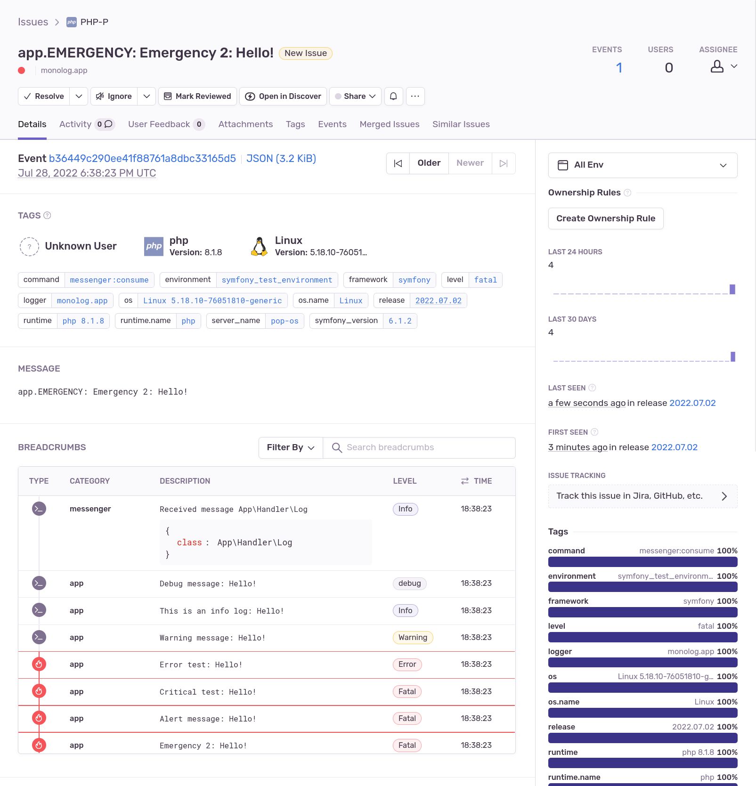

# Monolog Sentry Handler

[](https://github.com/B-Galati/monolog-sentry-handler/actions/workflows/ci.yml?query=branch%3Amain)
[](https://packagist.org/packages/bgalati/monolog-sentry-handler)
[](LICENCE)

It is a [Monolog](https://github.com/Seldaek/monolog) handler for Sentry PHP SDK v2 and v3 with breadcrumbs support.



## Features

-   Send each log record to a [Sentry](https://sentry.io) server
-   Send log records as breadcrumbs when they are handled in batch; the main reported log record is the one with the highest log level
-   Send log along with exception when one is set in the main log record context
-   Customize data sent to Sentry to fit your needs
-   Compatible with Monolog 1, 2 and 3

## Installation

The suggested installation method is via [composer](https://getcomposer.org/):

```bash
# For Sentry PHP SDK v3
composer require bgalati/monolog-sentry-handler

# For Sentry PHP SDK v2
composer require bgalati/monolog-sentry-handler:^1.2
```

## Basic usage

```php
<?php

use BGalati\MonologSentryHandler\SentryHandler;
use Sentry\State\Hub;

$sentryHandler = new SentryHandler(Hub::getCurrent());

/** @var $logger Monolog\Logger */
$logger->pushHandler($sentryHandler);

// Add records to the log
$logger->debug('Foo');
$logger->error('Bar');
```

Check out the [handler constructor](src/SentryHandler.php) to know how to control the minimum logging level and bubbling.

> **Note**
>
> -   It is a good idea to combine this handler with a `FingersCrossedHandler` and a `BufferHandler`
>     to leverage Sentry breadcrumbs. It gives maximum context for each Sentry event.
>
> Look at the symfony guide for a complete example with Monolog and symfony

## Documentation

-   [Symfony guide](doc/guide-symfony.md): it gives a way to integrate this handler to your app
-   [Working example with Symfony](https://github.com/B-Galati/monolog-sentry-handler-example)
-   [Extension points](doc/extension-points.md): Customize data sent to Sentry and more

## FAQ

### What are the differences with the official Monolog Sentry handlers?

At the moment the official SDK proposes two Monolog handlers:
- `Sentry\Monolog\Handler`: each logs becomes a Sentry event
  - Depending on the setup it can create a lot of noise.
- `Sentry\Monolog\BreadcrumbHandler`: each logs is added as a breadcrumb in the current event
  - It cannot be used only with Monolog: it requires default integrations to work correctly.

Both of them don't send event immediately. Thus, sending Sentry events happens; either when PHP process terminates or when the flush is done explicitly.

This lib proposes a Handler that is different:
- It flushes Sentry events on each call: looks like a standard for Monolog handlers
- It adds log records as breadcrumbs when it is used with a buffering handler like `FingersCrossedHandler`

### What about contributing it to the Monolog project?

As per this [comment](https://github.com/Seldaek/monolog/pull/1334#issuecomment-507297849), Monolog project does
not accept new handler with 3rd party dependencies.

> For new handlers with third-party dependencies IMO the right way is to publish as a third-party package,
> with requires on monolog and on whichever dependency is needed.
> It lets Composer resolve everything which makes more sense really.

## Contributing

Fork me.

Install dependencies with `make vendor`.

Run tests with `make tests`.

## Changelog

See [CHANGELOG.md](CHANGELOG.md).

## Credits

-   [Official Monolog handler](https://github.com/getsentry/sentry-php/blob/2.1.1/src/Monolog/Handler.php)
-   [Official Laravel Monolog handler](https://github.com/getsentry/sentry-laravel/blob/1.1.0/src/Sentry/Laravel/SentryHandler.php)
